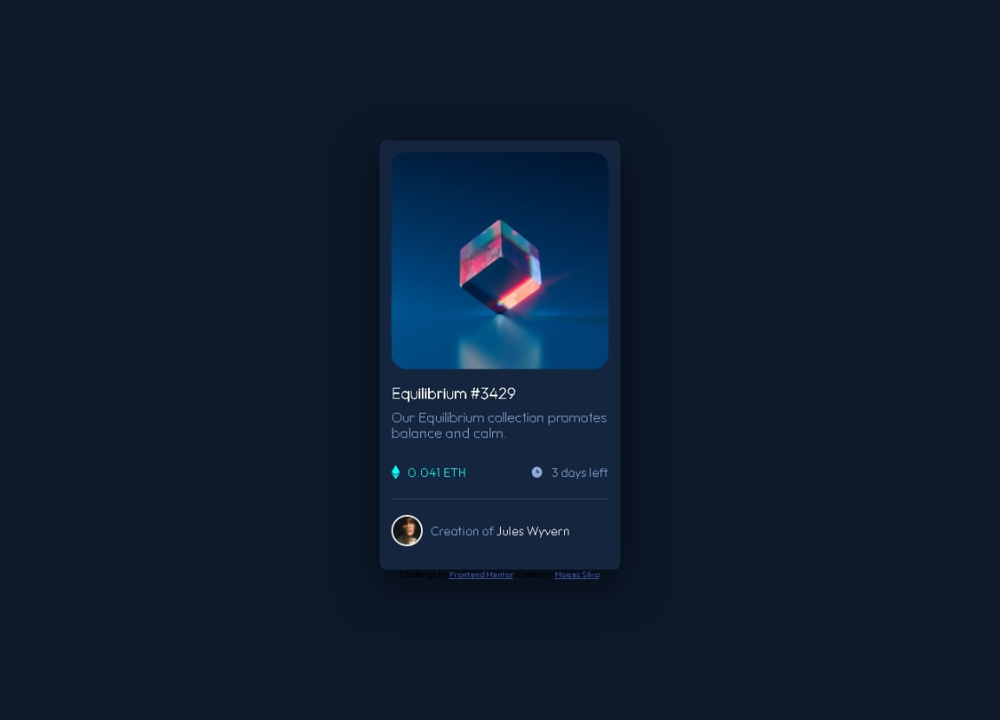

# Frontend Mentor - NFT preview card component solution

This is a solution to the [NFT preview card component challenge on Frontend Mentor](https://www.frontendmentor.io/challenges/nft-preview-card-component-SbdUL_w0U). Frontend Mentor challenges help you improve your coding skills by building realistic projects. 

## Table of contents

- [Overview](#overview)
  - [The challenge](#the-challenge)
  - [Screenshot](#screenshot)
  - [Links](#links)
- [My process](#my-process)
  - [Built with](#built-with)
  - [What I learned](#what-i-learned)
  - [Continued development](#continued-development)
  - [Useful resources](#useful-resources)
- [Author](#author)
- [Acknowledgments](#acknowledgments)

**Note: Delete this note and update the table of contents based on what sections you keep.**

## Overview

### The challenge

Users should be able to:

- View the optimal layout depending on their device's screen size
- See hover states for interactive elements

### Screenshot



### Links

- Solution URL: [Add solution URL here](https://your-solution-url.com)
- Live Site URL: [https://knitaxd.github.io/]

### Built with

- Semantic HTML5 markup
- CSS custom properties
- Flexbox

### What I learned

After a long time without practicing HTML and CSS, i took this challenge and that help me a lot to reinforcement my little knowledge and learn new things. The section of which I am proud, was in the hover of the image in the NFT card, i found a new way to do these styles.


```css
.card-box_img--overlay{
    position: absolute;
    top: 15px;
    right: 0;
    bottom: 0;
    left: 15px;
    height: 89%;
    width: 90%;
    opacity: 0;
    transition: .3s ease;
    background-color: hsl(178, 100%, 50%);
    padding: inherit;
    border-radius: inherit;
}

.card-box_img:hover .card-box_img--overlay{
    opacity: 0.6;
}

.icon-overlay{
    color: #fff;
    font-size: 170px;
    position: absolute;
    top: 50%;
    left: 50%;
    transform: translate(-50%, -50%);
    -ms-transform: translate(-50%, -50%);
    text-align: center;
    width: 100%;
    height: 100%;
}

#icon-view{
    color: #fff;
}
```

### Continued development

I will really like continue learning about animations and transitions on CSS because it can change every web page a lot. Also i´m enjoying learning new ways to do some things.

### Useful resources

- [W3 SCHOOLS](https://www.w3schools.com/css/) - W3 Schools really helps me to record some selectors and properties that i forgot.

## Author

- Frontend Mentor - [@knitaxd](https://www.frontendmentor.io/profile/yourusername)
- Twitter - [@knitaxd](https://twitter.com/knitaxd)

## Acknowledgments

I use these codes to resolve some doubts, u can watch them here:

https://www.geeksforgeeks.org/how-to-create-icon-hover-effect-using-css/
https://ishadeed.com/article/responsive-design-height/
